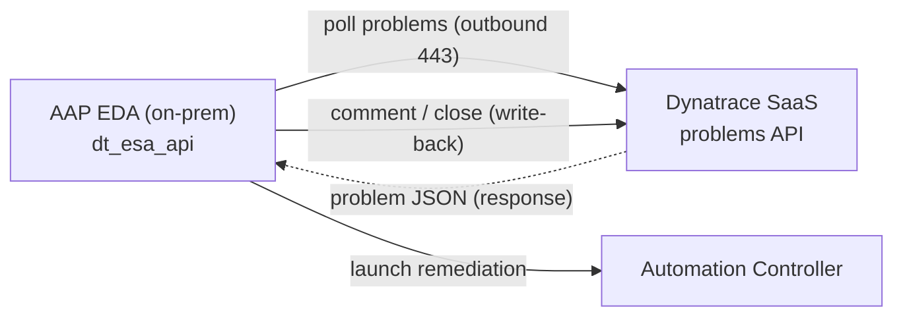

# aap.eda.dynatrace — Dynatrace → AAP Event-Driven Ansible (pull)

Event-driven automation that lets **Ansible Automation Platform** react to
**Dynatrace** problems — using the **pull** model: AAP's Event-Driven Ansible
polls the Dynatrace problems API and launches remediation. No OneAgent changes,
and **no EdgeConnect** required.

> *"Dynatrace sees the problem. AAP fixes it — on your terms, from inside your
> own network."*

See [`ROADMAP.md`](ROADMAP.md) for the phase plan and decisions log, and
[`docs/architecture.md`](docs/architecture.md) for the network-traffic flows.

## Why pull (the EdgeConnect question)

EdgeConnect is an **inbound** connector — it lets Dynatrace SaaS reach a private
endpoint. The pull model runs the other way: **AAP reaches out to Dynatrace**
over outbound HTTPS, which on-prem OpenShift already allows. So EdgeConnect
drops out of scope. Full comparison in [`docs/architecture.md`](docs/architecture.md).



## Repo layout

```
aap.eda.dynatrace/
├── ROADMAP.md              ← phase plan + decisions log (read this first)
├── CHANGELOG.md
├── CLAUDE.md               ← Claude Code working guidelines for this repo
├── CONTRIBUTING.md
├── ansible.cfg.example     ← Hub galaxy_server template → ~/.ansible.cfg
├── collections/
│   └── requirements.yml    ← dynatrace.event_driven_ansible 1.2.3 + CaC stack
├── decision-environment.yml          ← ansible-builder DE def (dt_esa_api source)
├── decision-environment-requirements.yml
├── aap_config/             ← Configuration as Code (infra.aap_configuration)
│   ├── load.yml / validate.yml        ← apply + verify all DT-EDA objects
│   ├── group_vars/all.yml             ← connection, names, org, secrets-by-ref
│   └── files/*.yml                    ← Hub/Controller/EDA object data
├── rulebooks/
│   └── dynatrace_problems.yml  ← dt_esa_api poll → notify-only (Phase 3)
├── playbooks/
│   ├── notify_problem.yml             ← notify-only action (debugs the event)
│   └── raise_test_problem.yml         ← raise a synthetic problem on demand
├── docs/
│   ├── INSTALL.md          ← setup: manual (UI) + automated (CaC) paths
│   ├── DEMO.md             ← meeting runbook + in-meeting Claude prompts
│   ├── architecture.md     ← network-traffic flows (Mermaid)
│   ├── decision-environment.md        ← DE build/push/PAH-sync runbook
│   ├── dev-environment.sh.example  ← copy → docs/dev-environment.sh (gitignored)
│   └── images/             ← screenshots (shot list in images/README.md)
├── .claude/skills/         ← getting-started skills (dt-eda-build-de/install/demo)
└── .github/                ← community health files + CI (yamllint + secret-leak guard)
```

## Getting started

The fastest path is the three repo-based **Claude Code skills** (in
[`.claude/skills/`](.claude/skills/)), which drive each step interactively with
the right guardrails:

1. **`dt-eda-build-de`** — build the decision environment and push it to quay.io.
2. **`dt-eda-install`** — apply `aap_config/load.yml`: create the Controller + EDA
   objects, sync the DE into PAH, and start the rulebook activation.
3. **`dt-eda-demo`** — raise a synthetic Dynatrace problem and watch the
   `DT-EDA - Notify` job fire.

Full step-by-step (manual UI **and** automated CaC) is in
[`docs/INSTALL.md`](docs/INSTALL.md); the meeting/demo runbook (how to trigger +
observe + talk track + Claude prompts) is in [`docs/DEMO.md`](docs/DEMO.md).

To do it by hand:

1. Seed your Hub token: `cp ansible.cfg.example ~/.ansible.cfg` and fill in the offline token.
2. Create your local secrets file: `cp docs/dev-environment.sh.example docs/dev-environment.sh` and fill in the Dynatrace tenant + token and the AAP connection. **Never commit it** — it's gitignored.
3. Install collections: `ansible-galaxy collection install -r collections/requirements.yml`.
4. Build + push the DE — see [`docs/decision-environment.md`](docs/decision-environment.md).
5. Apply: `source docs/dev-environment.sh && ansible-playbook -i aap_config/inventory/ aap_config/load.yml` (see [`aap_config/README.md`](aap_config/README.md)).
6. Demo: `ansible-playbook playbooks/raise_test_problem.yml`.

Background and phase status live in [`ROADMAP.md`](ROADMAP.md) (Phases 0–7).

## Development environment

- **AAP:** AAP 2.6 from the **Ansible Product Demos** RHDP environment (install additively; namespace objects).
- **Dynatrace:** a dev SaaS tenant. The real tenant id/URL lives only in your gitignored `docs/dev-environment.sh`; committed files use the `<env-id>` placeholder.

## Related

| Resource | Role |
|----------|------|
| [Dynatrace/Dynatrace-EventDrivenAnsible](https://github.com/Dynatrace/Dynatrace-EventDrivenAnsible) | The `dt_esa_api` / `dt_webhook` source collection (verified source of truth) |
| [dynatrace/event_driven_ansible (Red Hat Catalog)](https://catalog.redhat.com/en/software/collection/dynatrace/event_driven_ansible) | Certified collection on Automation Hub |
| Dynatrace EdgeConnect docs | https://docs.dynatrace.com/docs/ingest-from/edgeconnect (inbound-only; why pull avoids it) |

## License

[MIT](LICENSE)
