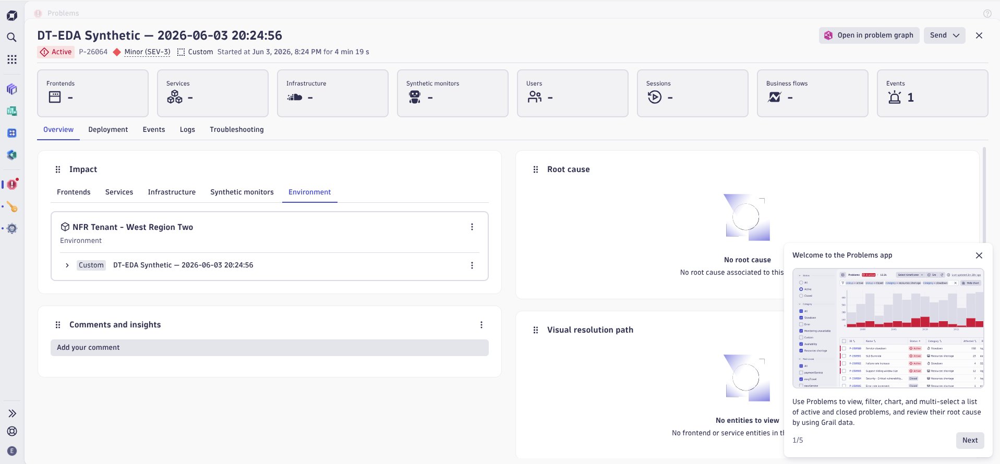
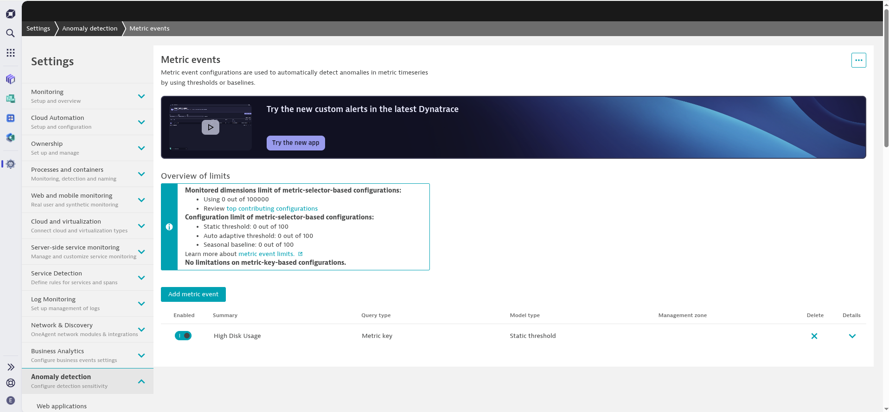
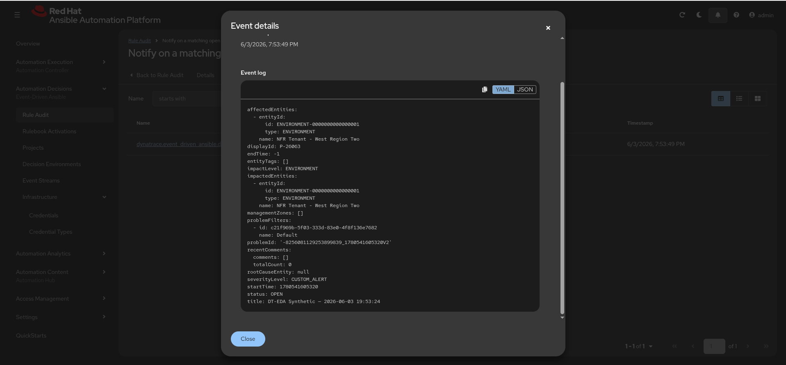
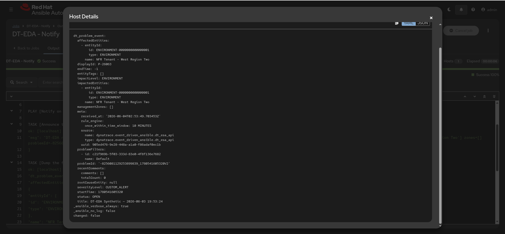

# Demo runbook — Dynatrace → AAP EDA (pull)

The 90-second story: **"Dynatrace sees the problem. AAP fixes it — on your terms,
from inside your own network."** AAP polls Dynatrace outbound (no EdgeConnect),
matches a rulebook, and launches a job. Today it's **notify-only**.

Setup is already deployed (org **IT Service Automation**, namespaced `DT-EDA -`).
To stand it up from scratch see [`INSTALL.md`](INSTALL.md).

---

## Pre-flight (2 min before)

```bash
cd /home/eames/git-repos/aap.eda.dynatrace && source docs/dev-environment.sh
```
1. **Activation running?** Automation Decisions → Rulebook Activations →
   `DT-EDA - Problem Remediation` = **Running**. (Or via API — see Claude prompts.)
2. **Clean board?** Close any leftover open `DT-EDA Synthetic` problems so the
   demo starts fresh (Claude can do this).
3. Have two browser tabs ready: **Dynatrace** (Problems) and **AAP**.

---

## Trigger — two ways, side by side

A *pull* activation has **no run button**; it polls every ~60s. You trigger it by
making a problem appear in Dynatrace.

### A. On-demand helper (reliable — use this live)
```bash
ansible-playbook playbooks/raise_test_problem.yml
```
Ingests a `CUSTOM_ALERT` (events.ingest token). A problem opens immediately whose
title contains `DT_MATCH_TITLE` ("DT-EDA Synthetic"). Each run is a unique problem,
so it fires every time.



### B. Real metric-event threshold (the production story)
A **High Disk Usage** metric event is already configured in the tenant
(Dynatrace → **Settings → Anomaly detection → Metric events**):
- Metric `builtin:host.disk.usedPct`, **static threshold > 80%** (3 of 5 samples).
- Problem title **`High Disk Usage on {entityname}`** — the rulebook regex
  (`DT_MATCH_TITLE = "DT-EDA Synthetic|High Disk Usage"`) matches it, so a real
  disk problem fires the same `DT-EDA - Notify` loop.


- **To trip it live** you need a OneAgent-monitored host whose disk you can push
  past 80%. The dc1.azure-built hosts aren't registered in Dynatrace yet — tracked
  in **[dc1.azure#1](https://github.com/ericcames/dc1.azure/issues/1)** (add
  OneAgent during provisioning). Until then, use **A** to fire live and present
  **B** as the production path.
- Talking point: pull works identically whether the problem is synthetic or a real
  Davis-detected one — AAP just polls the problems API.

> Recommended flow: lead with **A** for a guaranteed fire, then explain **B** as
> exactly what happens with real production problems.

---

## Observe in AAP (what to click)

1. **Automation Decisions → Rulebook Activations → `DT-EDA - Problem Remediation`
   → History** (and **Rule Audit**) — the event arrived and the rule matched.


2. **Automation Execution → Jobs → `DT-EDA - Notify`** — the launched job. Open its
   output: it prints the matched problem — **display id, title, status, severity,
   impact, affected entities, problem id** — then the full event.


3. Tie it back: Dynatrace problem → `dt_esa_api` poll (outbound 443) → rulebook
   condition → `run_job_template` → job. No inbound, no EdgeConnect.

---

## Talk track (hit these points)
- **Pull, outbound-only** — AAP initiates every connection; nothing inbound, so
  **no EdgeConnect** to buy/operate. Decisioning lives in AAP rulebooks.
- **Certified content** — the `dt_esa_api` source is the Dynatrace-provided,
  Red Hat **certified + signed** collection (1.2.3), pulled from Automation Hub.
- **Config as Code** — the whole integration is `infra.aap_configuration` data
  applied by one playbook; reproducible, idempotent, namespaced.
- **Safe by default** — notify-only first; remediation later behind a workflow
  **approval node**; blast radius scoped by Dynatrace management zone *and* the
  rulebook condition.
- **Their environment** — runs on the AAP operator; rulebook syncs from **their
  Bitbucket**; DE pushed to **their PAH**.

---

## Reset between runs
Close the open test problem(s) so the next raise is clean (Claude prompt below),
or let the CUSTOM_ALERT auto-expire (~15 min). The throttle is keyed on
`event.problemId`, so re-polls of the same problem won't re-fire.

---

## Prompts for the Claude running in the meeting

This repo ships skills (`.claude/skills/`): **`dt-eda-demo`** drives exactly this.
Prime Claude first, then use the per-moment prompts. Claude: always
`source docs/dev-environment.sh` in the same shell as any command; auth is
username/password (never a token); this is notify-only; never print secret values.

- **Pre-flight:**
  `"Confirm the DT-EDA - Problem Remediation activation is running, and close any open DT-EDA Synthetic problems in Dynatrace so we start clean."`
- **Fire it (method A):**
  `"Raise a synthetic Dynatrace problem, then watch for the new DT-EDA - Notify job and show me the matched-problem line from its log."`
- **Show the data:**
  `"Pull the full dt_esa_api event from that Notify job's output so I can show the customer the real event shape."`
- **If something looks off:**
  `"The activation isn't firing — check its status and recent instance logs, and the latest DT-EDA - Notify job, and tell me what's wrong."`
- **Reset:**
  `"Close the open DT-EDA Synthetic problem(s) in Dynatrace."`
- **Re-deploy from scratch (if asked):**
  `"Run the dt-eda-install skill to re-apply aap_config/load.yml and confirm all objects + the activation."`
