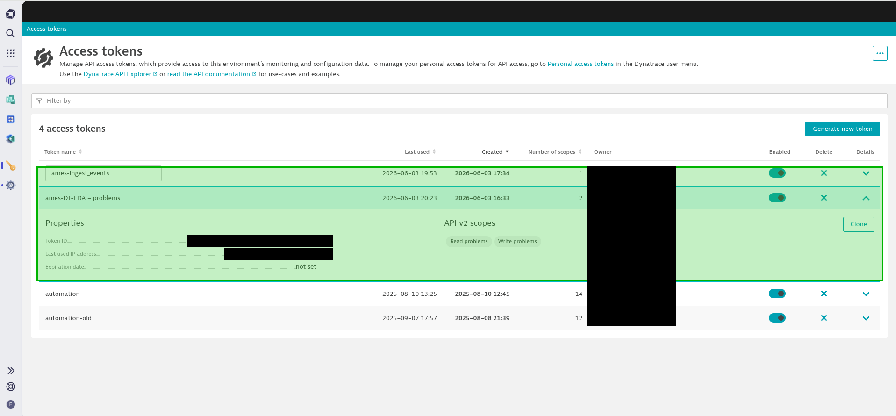
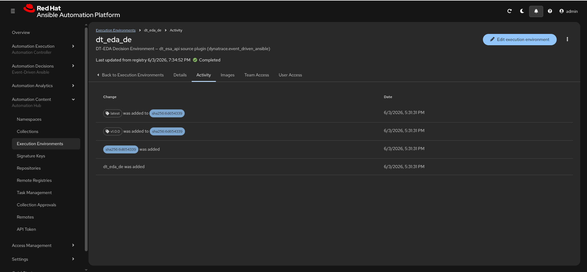
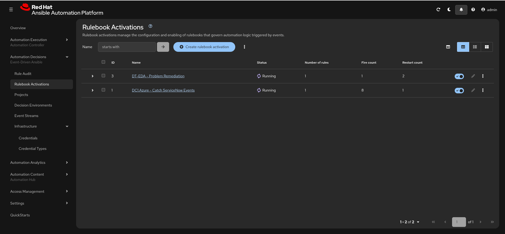
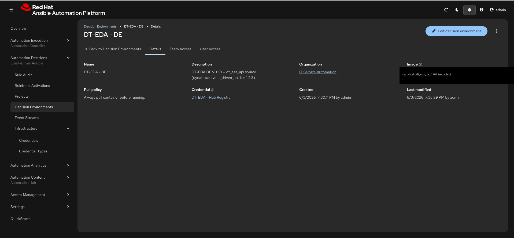
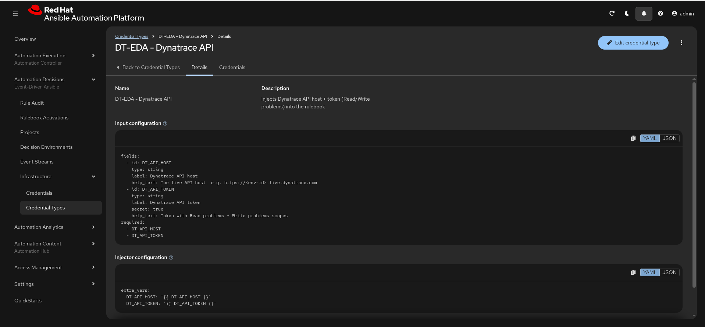
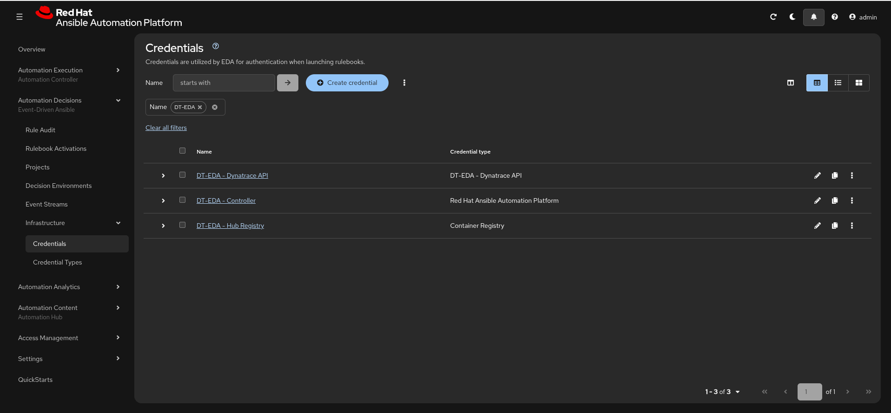
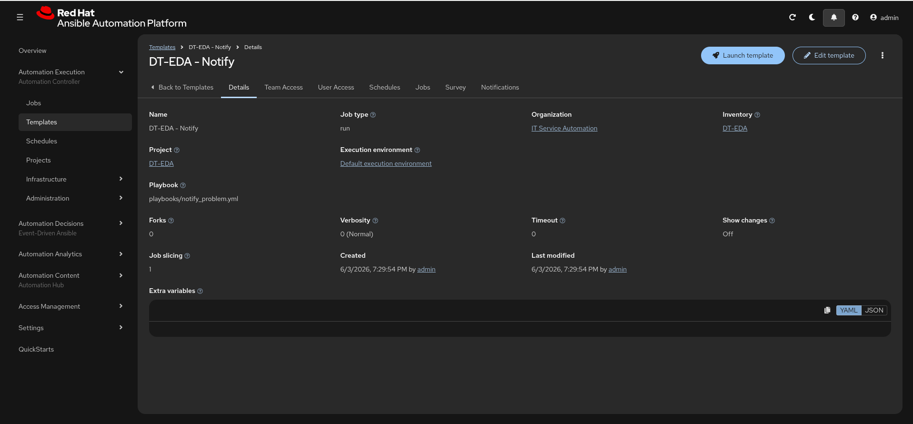
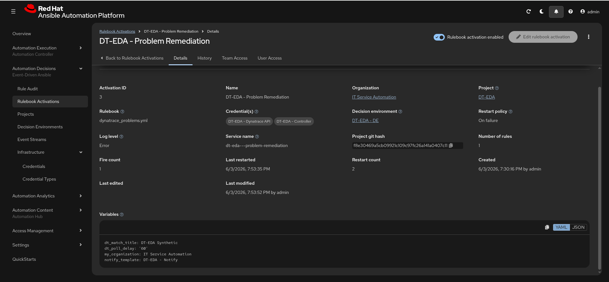

# Install — Dynatrace → AAP EDA (pull)

Two ways to stand up this integration:

- **[Automated path](#automated-path-config-as-code)** — `aap_config/load.yml`
  builds it as code (recommended; what the demo uses).
- **[Manual path](#manual-path-by-hand-in-the-aap-ui)** — click it together in the
  AAP UI, to understand each object.

Both produce the same thing: an EDA rulebook activation that polls the Dynatrace
problems API (outbound only — **no EdgeConnect**) and launches a job when a
matching problem opens. Architecture: [`architecture.md`](architecture.md).

> Screenshots live in [`images/`](images/) (shot list:
> [`images/README.md`](images/README.md)). Tenant ids, hostnames, token ids, and
> IPs are redacted.

---

## Prerequisites (both paths)

1. **AAP 2.5+** with **Event-Driven Ansible enabled** and a container registry
   reachable from the EDA pods (Private Automation Hub, or a public registry).
   *Customer note:* on the **AAP operator (OpenShift)**, EDA + Hub ship with the
   platform; confirm the EDA pods can pull from your registry.
2. **Dynatrace SaaS tenant** + two API tokens (Dynatrace → **Access Tokens →
   Generate**):
   - **Polling token** — scopes **Read problems** + **Write problems**.
   - **Test-problem token** — scope **Ingest events** (`events.ingest`) — only for
     raising synthetic problems on demand.
   - API host is the **`live`** host: `https://<env-id>.live.dynatrace.com`
     (not the `apps` UI host).


3. A **decision-environment image** containing
   `dynatrace.event_driven_ansible` (the stock DE does **not** have it) — build +
   tag + push it per [Build & push the decision environment](#build--push-the-decision-environment)
   below. **Customer:** push straight to **your Private Automation Hub**. **Demo:**
   push to `quay.io/zigfreed/dt-eda-de` and let PAH sync it.
4. A **git repo** holding `rulebooks/` and `playbooks/` (this repo, or your
   Bitbucket fork).

---

## Build & push the decision environment

The EDA activation runs in a decision-environment (DE) image carrying the
`dt_esa_api` source plugin. Build it once, tag it with an **immutable semver**
tag (never a moving `latest` for the activation to pin), and push it to the
registry your EDA pods pull from. Full provenance:
[`decision-environment.md`](decision-environment.md).

**1. Build** (uses `~/.ansible.cfg` to pull certified content; needs
`podman login registry.redhat.io` for the base image):
```bash
ansible-builder build -f decision-environment.yml -t dt-eda-de:latest --prune-images
```

**2. Verify** the source plugin is in the image:
```bash
podman run --rm dt-eda-de:latest bash -lc \
  'ansible-rulebook --version; ls /usr/share/ansible/collections/ansible_collections/dynatrace/event_driven_ansible/extensions/eda/plugins/event_source/'
```

**3. Tag + push.** Pick **one** target:

> **Customer — push directly to your Private Automation Hub** (no quay):
> ```bash
> podman login <pah-host>                       # AAP/Hub credentials
> podman tag dt-eda-de:latest <pah-host>/dt_eda_de:v1.0.0
> podman tag dt-eda-de:latest <pah-host>/dt_eda_de:latest
> podman push <pah-host>/dt_eda_de:v1.0.0
> podman push <pah-host>/dt_eda_de:latest
> ```
> The image now lives in PAH (Automation Content → Execution Environments). Point
> the Decision Environment at `<pah-host>/dt_eda_de:v1.0.0` with a Container
> Registry credential. **Skip** the quay→PAH sync step — the image is already in
> PAH.



> **This demo — push to public quay**, then PAH syncs it:
> ```bash
> podman tag dt-eda-de:latest quay.io/zigfreed/dt-eda-de:v1.0.0
> podman tag dt-eda-de:latest quay.io/zigfreed/dt-eda-de:latest
> podman push --authfile ~/.config/containers/auth.json quay.io/zigfreed/dt-eda-de:v1.0.0
> podman push --authfile ~/.config/containers/auth.json quay.io/zigfreed/dt-eda-de:latest
> ```
> `load.yml` then mirrors it into PAH (via `hub_ee_*`) and the activation pulls the
> PAH copy. (A new quay repo must exist + the robot account have Write before the
> first push.)

**Bump rule** for future versions: CVE-only rebuild → patch (`v1.0.1`) ·
+collection → minor (`v1.1.0`) · new base image → major (`v2.0.0`). Then update
`ee_version` (or `DT_EDA_DE_VERSION`) and re-apply.

---

## Automated path (Config as Code)

Mirrors [`dc1.azure`](https://github.com/ericcames/dc1.azure). Full reference:
[`../aap_config/README.md`](../aap_config/README.md).

1. **Secrets** — copy and fill the gitignored env file:
   ```bash
   cp docs/dev-environment.sh.example docs/dev-environment.sh
   # edit: AAP host + admin creds, DT_API_HOST, DT_API_TOKEN, DT_API_EVENT_TOKEN
   ```
2. **Collections** (uses `~/.ansible.cfg` certified/validated):
   ```bash
   ansible-galaxy collection install -r collections/requirements.yml
   ```
3. **Build + push the decision environment** — see
   [Build & push the decision environment](#build--push-the-decision-environment).
   *Customer:* after pushing straight to PAH, set
   `DT_EDA_DE_IMAGE=<pah-host>/dt_eda_de:v1.0.0` and drop
   `aap_config/files/hub_ee_*.yml` (no quay→PAH sync needed — the image is already
   in PAH).
4. **Apply** (creates Controller + EDA objects, syncs the DE into PAH *(demo)*,
   attaches the registry credential, starts the activation, validates):
   ```bash
   source docs/dev-environment.sh && \
   ansible-playbook -i aap_config/inventory/ aap_config/load.yml
   ```
   Re-runs are idempotent. Override the org with `DT_EDA_ORG`, the git branch with
   `DT_EDA_SCM_BRANCH`, the DE tag with `DT_EDA_DE_VERSION`.
5. **Verify** — `load.yml` asserts every object; then confirm the activation is
   running (UI: **Automation Decisions → Rulebook Activations →
   `DT-EDA - Problem Remediation`**, status **Running**).



That's it — skip to [Trigger & observe](#trigger--observe).

---

## Manual path (by hand in the AAP UI)

Create the objects in this order. Names use the `DT-EDA -` prefix so they
co-exist in a shared AAP. *(Customer: substitute your org, repo URL, registry.)*

### 1. Decision environment
**Automation Decisions → Decision Environments → Create decision environment.**
- Name: `DT-EDA - DE`
- Image: your **PAH** path `<pah-host>/dt_eda_de:v1.0.0` (demo:
  `quay.io/zigfreed/dt-eda-de:v1.0.0`)
- Credential: a **Container Registry** credential for the PAH/private registry
  (skip only if the image is public).



### 2. EDA credential type (injects the Dynatrace token into the rulebook)
**Automation Decisions → Credential Types → Create credential type.**
- Name: `DT-EDA - Dynatrace API`
- Input configuration (YAML):
  ```yaml
  fields:
    - id: DT_API_HOST
      type: string
      label: Dynatrace API host
    - id: DT_API_TOKEN
      type: string
      label: Dynatrace API token
      secret: true
  required: [DT_API_HOST, DT_API_TOKEN]
  ```
- Injector configuration (YAML):
  ```yaml
  extra_vars:
    DT_API_HOST: "{{ DT_API_HOST }}"
    DT_API_TOKEN: "{{ DT_API_TOKEN }}"
  ```



### 3. EDA credentials
**Automation Decisions → Credentials → Create credential** (×2):
- `DT-EDA - Dynatrace API` — type `DT-EDA - Dynatrace API`; set `DT_API_HOST` =
  your `https://<env-id>.live.dynatrace.com` and `DT_API_TOKEN` = the polling
  token.
- `DT-EDA - Controller` — type **Red Hat Ansible Automation Platform**; Host =
  `https://<your-aap>/api/controller/`, username/password (lets the rulebook
  launch the job).



### 4. EDA project (syncs the rulebook)
**Automation Decisions → Projects → Create project.**
- Name: `DT-EDA`; SCM type Git; URL = your repo (public → no credential;
  Bitbucket/private → add a **Source Control** credential). Sync it.

### 5. Controller project, inventory, job template
**Automation Execution → Projects → Create project** — `DT-EDA`, same git URL.
**Automation Execution → Inventories → Create inventory** — `DT-EDA` (empty is
fine; the notify playbook runs on localhost).
**Automation Execution → Templates → Create job template** — `DT-EDA - Notify`,
project `DT-EDA`, inventory `DT-EDA`, playbook `playbooks/notify_problem.yml`,
**Prompt on launch → Variables** enabled.



### 6. Rulebook activation (the polling loop)
**Automation Decisions → Rulebook Activations → Create rulebook activation.**
- Name: `DT-EDA - Problem Remediation`
- Project `DT-EDA`; Rulebook `dynatrace_problems.yml`; Decision environment
  `DT-EDA - DE`
- Credentials: `DT-EDA - Dynatrace API` **and** `DT-EDA - Controller`
- Variables (extra_vars):
  ```yaml
  dt_match_title: "DT-EDA Synthetic"   # substring the rule matches in the problem title
  dt_poll_delay: 60
  my_organization: "IT Service Automation"
  notify_template: "DT-EDA - Notify"
  ```
- Enable it. It should reach **Running** within a minute (it pulls the DE).



---

## Trigger & observe

A *pull* activation has **no run button** — it polls automatically. You trigger
the integration by making a problem appear in Dynatrace.

**Trigger (Dynatrace):**
- *Quick / on-demand:* `source docs/dev-environment.sh && ansible-playbook playbooks/raise_test_problem.yml`
  (ingests a CUSTOM_ALERT via the events.ingest token; opens a problem whose title
  contains `DT_MATCH_TITLE`).
- *Production pattern:* a Dynatrace **metric event** / threshold trips → Davis
  opens a problem. See [`DEMO.md`](DEMO.md) for both, side by side.

**Observe (AAP):**
1. **Automation Decisions → Rulebook Activations → `DT-EDA - Problem Remediation`
   → History/Rule Audit** — the event arrives and the rule fires.


2. **Automation Execution → Jobs → `DT-EDA - Notify`** — the launched job; its
   output shows the matched problem (id, title, severity, impact, affected
   entities).


**Optional write-back:** the polling token has Write-problems scope, so a later
phase can comment/close the Dynatrace problem from the playbook.

---

## Customer adaptation (operator + Bitbucket) — quick checklist
- Build the DE in your pipeline; **push it straight to your Private Automation
  Hub** (`podman push <pah-host>/dt_eda_de:<ver>`); reference that PAH image in the
  Decision Environment with a Container Registry credential. (No quay; drop the
  `hub_ee_*` sync files.)
- Point both projects (`DT_EDA_SCM_URL`) at your **Bitbucket** repo; add a Source
  Control credential (EDA + Controller each need their own).
- Set `my_organization` / `DT_EDA_ORG` to your org.
- Scope safely: a Dynatrace **management zone** on the token, and/or tighten the
  rulebook condition on `event.managementZones` / `event.severityLevel`.
- Start **notify-only**; add remediation behind a workflow-approval node later.

## Troubleshooting
- **Activation fails with image-pull error** — the DE registry credential isn't
  attached, or the image/tag is wrong. Re-run `load.yml` (it re-attaches +
  restarts), or set the DE credential in the UI.
- **EDA object create fails `Unsupported parameters: controller_token`** — use
  username/password, not a token (certified `ansible.eda` modules reject tokens).
- **No problem opens from the helper** — set `DT_TEST_ENTITY_SELECTOR`
  (e.g. `type(HOST)`); some tenants need the event attached to an entity.
