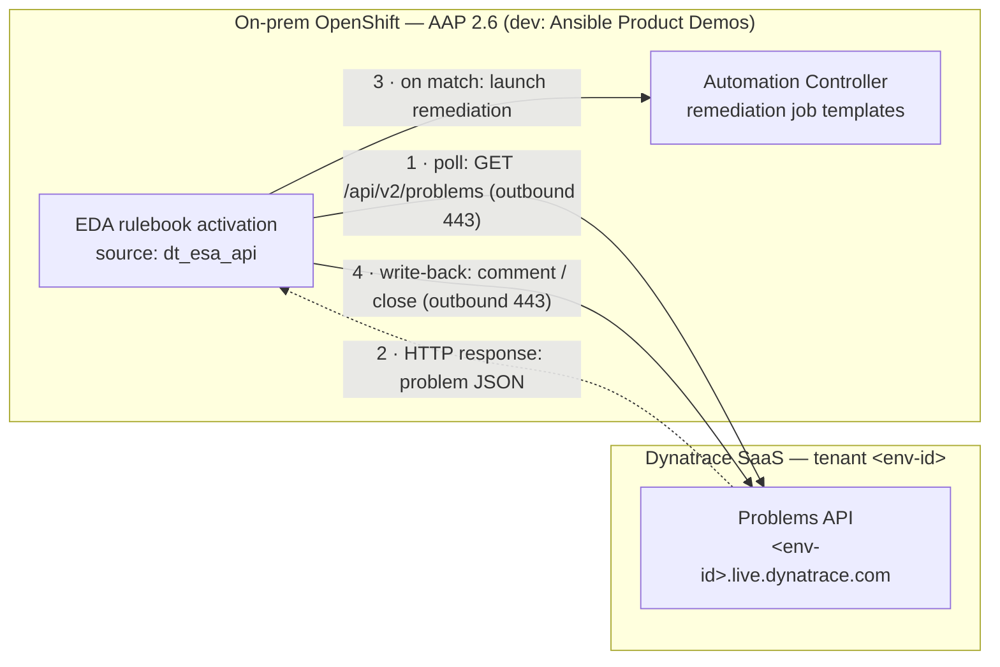
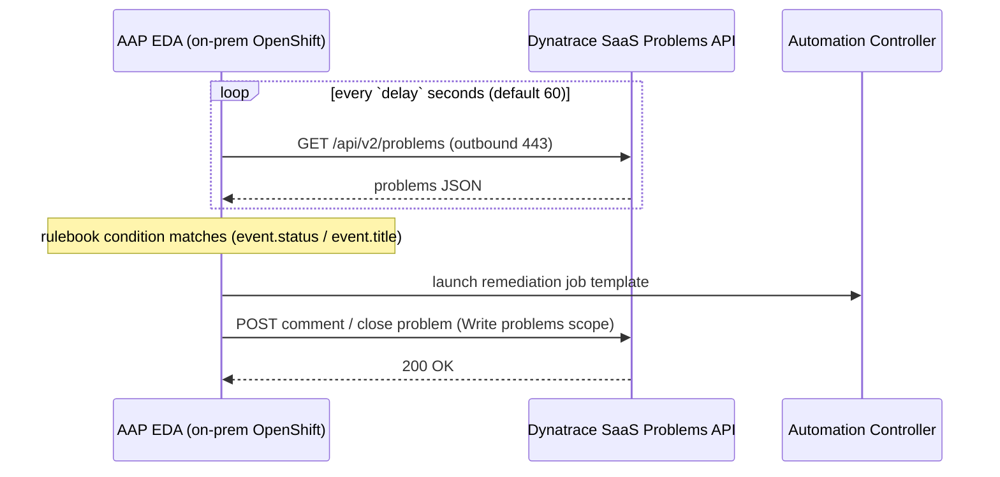

# Architecture — network traffic flows

How AAP Event-Driven Ansible and Dynatrace SaaS communicate in the **pull** model.

## The one rule that shapes everything

**Every connection is initiated by AAP, outbound.** Dynatrace SaaS never opens a
connection into your network — it only ever *responds* to AAP's requests, or
*receives* AAP's write-back. Because there is no inbound, **EdgeConnect is not
required** (EdgeConnect exists only to let Dynatrace SaaS reach private
endpoints — the opposite direction).

## Topology and directions

**Legend:** solid arrows = connections **AAP initiates** (outbound HTTPS 443);
dashed arrow = the HTTP **response** that returns on AAP's own poll connection.
No arrow originates at Dynatrace.

## Ordered flow

## Why not push (and when EdgeConnect would come back)

The alternative is **push**: Dynatrace Workflows send events *into* an AAP event
stream. That requires Dynatrace SaaS to reach the **private** AAP route — an
inbound connection — which is exactly what **EdgeConnect** is for. We chose pull
specifically to avoid that. If a future use case needs Dynatrace Workflows to
orchestrate, revisit push + EdgeConnect as a separate workstream.

| | Pull (this repo) | Push (not used) |
|---|---|---|
| Who connects | AAP → Dynatrace (outbound) | Dynatrace → AAP (inbound) |
| Mechanism | `dt_esa_api` polls problems API | Event stream / `dt_webhook` |
| EdgeConnect | **Not needed** | Required for private AAP |
| Decisioning | In AAP/EDA rulebooks | In Dynatrace Workflows |

## Connectivity requirements (pull)

- Outbound **443** from the EDA activation pod to `https://<env-id>.live.dynatrace.com`.
- An **egress proxy**? Set the plugin's native `proxy:` parameter (see the rulebook).
- Dynatrace **access token** with **Read problems** + **Write problems**.
- **No** inbound firewall rules, route exposure, or EdgeConnect.

> A polished PNG of these flows can be added under [`images/`](images/) later;
> the Mermaid above renders directly on GitHub and stays diff-able.
